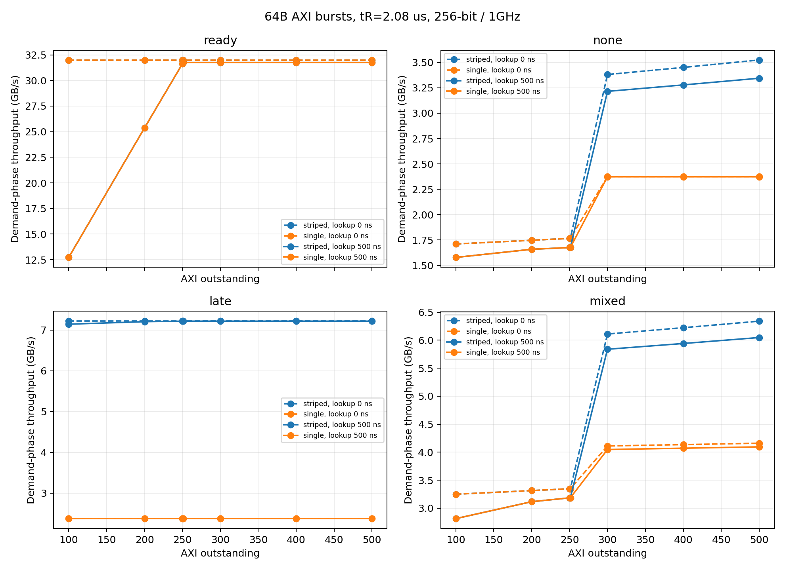
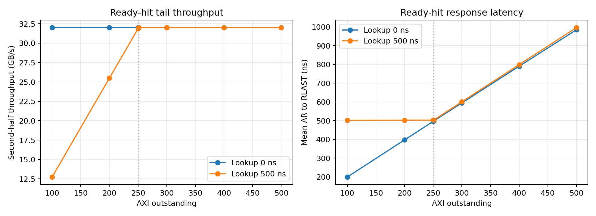

# 64B 읽기에서 500ns 프리페치 조회 지연의 영향

기존 `axi_burst_sim.py`를 사용한 추가 실험이다. tR=2.08µs, AXI burst=64B, outstanding=100~500에서 조회 지연 0ns와 500ns를 비교했다.

## 실행 조건과 해석

- 112개 조건, 조건당 32×64KiB 동시 요청. 각 요청은 64B burst 1024개로 나뉜다.
- 64B는 AXI 반환·조회 단위다. NAND page는 기존 16KiB이며 같은 page의 256개 burst는 NAND 읽기 하나로 병합한다. 독립 랜덤 64B 주소 workload나 64B NAND sensing 모델은 아니다.
- AXI는 기존 GUI와 같은 256bit·1GHz, RREADY 항상 참. 상한 32GB/s, 64B 반환 2ns, AR 간격 최소 1ns. Config의 기존 기본값 500MHz와 구분한다.
- Outstanding은 AR 수락부터 RLAST까지이며 모든 요청·burst는 전역 in-order로 반환한다. 100, 200, 300, 400, 500에 경계 250, 251을 추가했다.
- 500ns는 AR 이후 burst별 hit/miss 판정 지연이다. 조회는 병렬이고 admission 병목은 없다. Miss의 NAND 발행은 조회 완료 후이며 동일 page의 in-flight read에 병합한다.
- NAND: 4칩, 칩당 6 plane, 채널당 2.4GB/s, command 0.1µs, turnaround 0.05µs, ECC 0.2µs, 버퍼 8MiB. single은 요청 내부 한 칩 배치·공유 1채널, striped는 4칩·4채널 분산이다.
- ready는 모든 데이터가 충분히 일찍 준비된 상한 비교, none은 프리페치 없음, late는 demand 1.5µs 전 발행, mixed는 요청 절반만 일찍 준비한다. 실제 ready hit 비율은 CSV에서 확인한다.
- 처리량은 첫 AR부터 마지막 RLAST까지이며 사전 prefetch 공급 시간을 제외한다. Second-half 처리량도 유한 실행 후반부의 측정값이며 지속 가능한 NAND 공급률을 뜻하지 않는다.

## Ready hit: 4채널 결과

| Outstanding | 조회 0ns GB/s | 조회 500ns GB/s | 처리량 감소 | 500ns 후반 GB/s | 평균 AR→RLAST 0ns / 500ns (ns) |
|---:|---:|---:|---:|---:|---:|
| 100 | 32.000 | 12.726 | 60.23% | 12.742 | 199.40 / 502.15 |
| 200 | 32.000 | 25.370 | 20.72% | 25.493 | 397.58 / 502.61 |
| 250 | 32.000 | 31.632 | 1.15% | 31.872 | 496.21 / 502.95 |
| 251 | 32.000 | 31.758 | 0.76% | 32.000 | 498.18 / 502.96 |
| 300 | 32.000 | 31.758 | 0.76% | 32.000 | 594.53 / 600.47 |
| 400 | 32.000 | 31.758 | 0.76% | 32.000 | 790.27 / 798.80 |
| 500 | 32.000 | 31.758 | 0.76% | 32.000 | 984.79 / 996.21 |

64B 반환 시간 T=2ns, 조회 L=500ns이다. Ready-hit 장기 처리량 상한은 `min(32 GB/s, outstanding × 64B / 502ns)`이며 R 채널을 끊김 없이 쓰는 최소 창 크기는 `ceil((L+T)/T)=251`이다. 조회 서비스가 병렬인 현재 가정에서만 적용된다.

Outstanding 300 이상에서도 첫 응답은 502ns가 걸린다. 조회 0ns의 첫 응답 2ns보다 500ns 늦고, 유한 workload 전체 처리량에는 초기 지연이 남는다. 창 크기를 늘리면 더 많은 AR을 일찍 수락하므로 처리량 포화 이후 평균 AR→RLAST는 증가할 수 있다.

tR은 이미 준비된 ready hit 경로에 들어가지 않는다. Miss 경로는 tR 2.08µs 외에 16KiB page 전송 약 6.827µs, command·ECC·자원 대기가 포함된다. 따라서 ready-hit 경계만으로 miss 성능을 예측하면 안 된다.





## NAND가 필요한 경로: 4채널 비교

| 조건 | Outstanding | 조회 0ns GB/s | 조회 500ns GB/s | 감소 | 평균 AR→RLAST 0ns / 500ns (µs) |
|---|---:|---:|---:|---:|---:|
| none | 100 | 1.712 | 1.579 | 7.75% | 3.739 / 4.052 |
| none | 200 | 1.748 | 1.659 | 5.07% | 7.321 / 7.712 |
| none | 300 | 3.381 | 3.215 | 4.91% | 5.675 / 5.968 |
| none | 400 | 3.451 | 3.278 | 5.00% | 7.411 / 7.801 |
| none | 500 | 3.524 | 3.344 | 5.10% | 9.069 / 9.557 |
| late | 100 | 7.218 | 7.143 | 1.03% | 0.886 / 0.895 |
| late | 200 | 7.218 | 7.205 | 0.18% | 1.772 / 1.774 |
| late | 300 | 7.218 | 7.218 | 0.00% | 2.656 / 2.656 |
| late | 400 | 7.218 | 7.218 | 0.00% | 3.540 / 3.540 |
| late | 500 | 7.218 | 7.218 | 0.00% | 4.422 / 4.422 |
| mixed | 100 | 3.249 | 2.813 | 13.41% | 1.969 / 2.274 |
| mixed | 200 | 3.314 | 3.115 | 5.98% | 3.861 / 4.106 |
| mixed | 300 | 6.110 | 5.838 | 4.45% | 3.138 / 3.285 |
| mixed | 400 | 6.223 | 5.941 | 4.53% | 4.107 / 4.302 |
| mixed | 500 | 6.339 | 6.047 | 4.61% | 5.036 / 5.280 |

## 검증 및 재현

기존 17개 검증과 64B 추가 3개 검증을 통과했다. 추가 검증은 독립 AR/RLAST 재귀식과의 일치, outstanding 250/251 경계, 64B miss의 page 병합·조회 이전 발행 금지를 확인한다.

기존 코드의 스케줄링 순서는 유지하고 dispatch가 완료된 page를 재검색하지 않도록 했다. HOL 집계는 현재 outstanding 범위만 검사한다. 전체 과거 burst를 매 이벤트마다 훑는 비용을 줄여 64B 실험을 실행할 수 있게 했다.

```sh
python3 -m unittest -q
python3 experiments/run_64b_sweep.py
python3 experiments/summarize_64b.py
```

`sweep.csv`에 평균·p99 burst 응답, request 응답, 전체·후반 처리량, first burst 응답, hit/late 비율, HOL idle, NAND bytes를 기록했다. `manifest.json`에는 전체 기준 설정·소스 SHA256·원본 commit을 저장했다.

기존 GUI는 기존 tR 3µs·4KiB 데이터 그대로다. 이번 결과는 이 디렉터리의 CSV·그래프로 확인한다. 제품 실측 또는 RTL 검증은 아니다.
