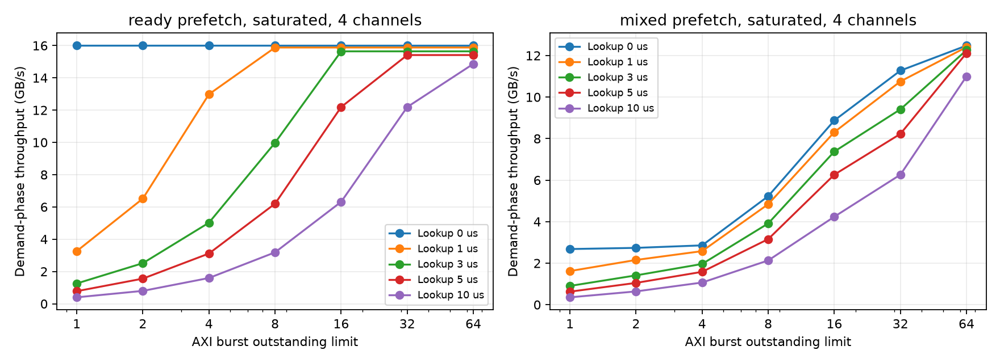

# tR 3µs에서 판정 지연과 AXI outstanding의 관계

2026-10-01 실행. 기존 8개와 신규 9개 검증 통과. 784개 조건 × 32개 요청 = 25,088개 64KiB 읽기, 401,408개 AXI burst를 비교했다. 모든 수치는 모델 가정에 따른 결과다.

## 핵심 결과

4칩·독립 4채널, 모든 요청이 처음부터 대기하는 연속 부하에서의 처리량이다. 단위는 GB/s다.

| Prefetch 조건 | 판정 지연 µs | Outstanding 1 | 16 | 64 |
|---|---:|---:|---:|---:|
| 모두 준비됨 | 0 | 16.000 | 16.000 | 16.000 |
| 모두 준비됨 | 3 | 1.258 | 15.642 | 15.642 |
| 모두 준비됨 | 10 | 0.399 | 6.316 | 14.866 |
| 모두 miss | 0 | 1.463 | 5.979 | 6.481 |
| 모두 miss | 3 | 0.706 | 4.836 | 6.422 |
| 모두 miss | 10 | 0.320 | 3.189 | 6.287 |
| 준비된 hit 50% | 0 | 2.680 | 8.875 | 12.480 |
| 준비된 hit 50% | 3 | 0.905 | 7.377 | 12.262 |
| 준비된 hit 50% | 10 | 0.355 | 4.238 | 11.000 |
| 요청 1.5µs 전 발행 | 0 | 6.512 | 6.512 | 6.512 |
| 요청 1.5µs 전 발행 | 3 | 1.254 | 6.512 | 6.512 |
| 요청 1.5µs 전 발행 | 10 | 0.399 | 6.316 | 6.512 |



준비된 hit에서도 조회가 burst마다 3µs 걸리고 outstanding이 1개이면 처리량은 1.258GB/s다. 16개로 늘리면 조회를 겹쳐 수행하여 15.642GB/s로 올라간다. 10µs 조회에서는 16개로 부족해 6.316GB/s이며, 64개에서는 14.866GB/s다. 이 모델의 R 채널 최대 전송률은 16GB/s다. 유한 길이 32개 요청의 초기 조회 지연 때문에 최대치에 미달할 수 있다.

4KiB burst의 R 전송 시간은 0.256µs다. 충분히 긴 ready-hit 스트림에서 조회 지연 L을 숨기려면 대략 outstanding ≥ ceil((L + 0.256) / 0.256)가 필요하다. L=3µs이면 13개, 10µs이면 41개다. 이는 조회가 여러 burst에 대해 병렬 수행되고 R 반환 순서가 유지되는 현재 모델의 조건부 근사식이다.

Outstanding 증가는 개별 AR의 응답 시간을 반드시 줄이지 않는다. 3µs 조회의 ready 조건에서 평균 burst 응답은 outstanding 1에서 3.256µs, 16에서 4.129µs, 64에서 15.743µs다. 요청을 일찍 수락하여 R 채널 앞에 더 많이 대기시키는 동안 전체 처리량은 높아진다. 처리량과 AR 이후 응답 지연을 함께 봐야 한다.

## Hit 여부와 순서 대기

혼합 조건은 짝수 요청 miss, 홀수 요청 ready hit이며 요청 기준과 burst 기준 모두 50%의 준비된 hit다. 3µs 조회와 outstanding 64에서 R 채널의 순서 대기 유휴 시간은 약 36.931µs다. 뒤 burst의 조회 및 데이터 준비가 끝났어도 앞 burst가 준비되지 않아 반환하지 못한 구간만 합산한다. R이 이미 데이터를 전송 중인 정상 직렬화 시간은 제외한다.

late 조건은 각 명목 요청 시점 1.5µs 전에 prefetch를 발행한다. 항상 late hit라고 강제하지 않는다. NAND 대기와 AXI 입장 대기가 달라지면 AR 시점에는 이미 준비된 hit로 바뀔 수 있다. 따라서 CSV에는 AR 시점의 ready/late 비율과 조회 완료 시점의 ready 비율을 따로 기록한다. 측정 시점이 늦어서 hit 비율이 높아진 것을 정책 개선으로 오해하면 안 된다.

## 실험 정의

- tR 3µs, 16KiB page, 요청 64KiB, 정렬된 4KiB burst 16개. AXI 256bit·500MHz, RREADY 항상 참.
- AR 수락부터 RLAST까지를 AXI outstanding으로 세며 AR은 최대 매 사이클 1개를 수락한다. R은 전체 burst 순서대로 반환한다.
- 조회는 burst마다 AR 수락 후 시작하고 설정된 시간이 지나면 완료한다. 조회 자원의 직렬화나 처리량 제한은 없다. 같은 page를 참조하는 miss는 NAND 읽기 하나로 병합한다.
- none은 prefetch 데이터가 없어서 매번 miss 조회 경로를 거치는 조건이다. 조회 자체를 생략하는 bypass 조건은 아니다.
- ready는 요청 10,000µs 전 prefetch를 발행해 전체 데이터가 준비된 상한 비교 조건이다. 실험 32개 요청의 총 데이터는 2MiB이며 버퍼 한도는 8MiB다. 제한된 실제 예측기 성능을 의미하지 않는다.
- mixed는 홀수 요청만 10,000µs 전 읽고 짝수 요청은 miss로 둔다. 오예측으로 버려지는 읽기는 이번 비교에 없다.
- single·공유 1채널과 striped·독립 4채널, 연속 부하와 100µs 요청 간격을 비교했다.
- 판정 지연은 0, 0.5, 1, 2, 3, 5, 10µs. Outstanding은 1, 2, 4, 8, 16, 32, 64개다.
- NAND 채널 전송 2.4GB/s, command 0.1µs, turnaround 0.05µs, ECC 0.2µs. page sensing은 plane별 병렬, command는 칩별 직렬이다.

## 해석할 때 지켜야 할 경계

처리량은 첫 AR부터 마지막 RLAST까지의 demand 구간 기준이다. ready/mixed의 사전 prefetch 시간과 미리 사용한 NAND 대역폭은 분모에서 제외된다. 따라서 end-to-end 저장장치 처리량 또는 지속 가능한 prefetch 공급률로 해석하면 안 된다.

연속 부하에서는 모든 요청의 명목 도착 시점이 같아 요청 전체 지연에 입장 대기가 포함된다. CSV의 mean_request_service_us는 각 요청 첫 AR부터 최종 RLAST까지이며, mean_burst_latency_us는 burst별 AR 이후 지연이다. 100µs 간격 조건의 처리량에는 요청 사이 유휴 시간이 포함되어, 장치 최대 처리량을 나타내지 않는다.

기존 sim.py는 page 단위 반환에 burst당 주소 overhead를 더했다. 신규 모델은 독립 AR 채널과 R 전송을 분리하므로 모든 데이터가 준비된 64KiB의 최소 R 전송 시간은 4.096µs다. 기존 4.128µs와의 차이를 tR 감소의 효과로 계산하지 않는다.

실제 hit tag 조회가 한 번에 한 건만 처리되거나, 64KiB 요청 전체에 대해 한 번만 조회되면 결과가 달라진다. 현재는 burst별 병렬 조회 가정이다. AXI 신호 수준, 다중 ID의 재정렬, READY backpressure, NAND 명령과 데이터의 동일 bus 공유는 모델링하지 않았다.

## 실행과 근거

```sh
python3 -m unittest -v
python3 experiments/run_axi_sweep.py
.venv/bin/python experiments/summarize_axi.py
```

- 설정과 소스 SHA256: manifest.json
- 전체 수치: sweep.csv
- 혼합 조건 예시: example_events.csv 및 example_requests.csv
- 구현: ../../axi_burst_sim.py
- 검증: ../../test_axi_burst.py
