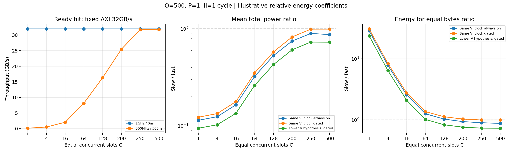
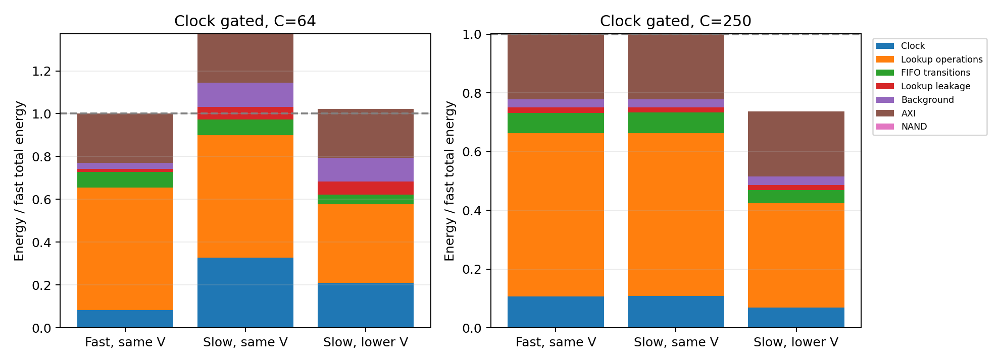

# 동일 병렬성: 1GHz·0ns와 500MHz·500ns의 성능·파워 비교

조회 클럭만 변경했다. AXI는 두 설계 모두 256bit·1GHz이며, NAND와 요청·버퍼 조건도 같다. 성능은 이벤트 시뮬레이터 결과다. 파워·에너지는 명시한 예시 계수에 따른 상대 비교이며 실제 장치의 W·J가 아니다.

## 비교 조건과 병렬성의 정의

- 108개 비교 쌍, 216개 성능 실행, 648개 에너지 계산. 조건당 32×64KiB 요청, AXI burst 64B.
- 주 실험: 슬롯 C=1/4/16/64/128/200/250/500, outstanding O=100/251/500, ready/none/late/mixed. 독립 파이프라인 P=1, 투입 간격 II=1클럭.
- 추가 실험: ready, O=500, C=64/250/500에서 P=1/2, II=2/4클럭을 비교한다.
- 각 비교 쌍은 C·P·II 클럭 수가 같다. 슬롯 C는 조회 시작부터 완료까지 점유하는 in-flight 용량이고 P는 새 조회를 받아들이는 독립 파이프라인 수다. 이 둘은 물리 SRAM 포트 수를 직접 지정하지 않는다.
- fast: 1GHz, 조회 서비스 0ns. 결과 판정 지연을 생략한 이상적 기준이지만 매 파이프라인의 투입 간격은 II×1ns로 제한한다. 0ns에도 조회·큐 에너지를 부여한다.
- slow: 500MHz, 조회 서비스 500ns(250클럭). 투입 간격은 II×2ns다. 지연 500ns는 별도 입력이며 클럭을 바꿨다고 자동으로 두 배로 늘리지 않는다.
- 조회 시작은 lookup clock edge에 정렬한다. 두 클럭의 위상 원점은 첫 demand 시각이다. 별도 CDC synchronizer 지연·bank 충돌·결과 큐 용량은 모델링하지 않는다.
- tR 2.08µs, page 16KiB, 4칩·4채널, 채널당 2.4GB/s, 칩당 6plane, buffer 8MiB. 명령 0.1µs, turnaround 0.05µs, ECC 0.2µs.
- 전역 in-order 반환, RREADY 항상 참. AR→RLAST 동안 outstanding을 점유하며 FIFO 조회 대기도 포함한다.

## 성능 상한

```text
Ready-hit B ≤ min(B_AXI, 64×P/II_ns, 64×C/L_ns, 64×O/(L_ns+2)) GB/s
L=0이면 슬롯 서비스 상한 64×C/L은 생략한다.
```

이는 장기 상한이며 초기 조회 지연, 클럭 정렬, 전역 반환 순서와 마지막 요청 종료 효과는 실제 실행에 추가된다. II=1·P=1이면 투입 상한은 fast 64GB/s, slow 32GB/s다. 따라서 slow도 C≥250, O≥251이면 ready-hit에서 AXI 32GB/s를 지속할 수 있다. II=2라면 slow의 투입 상한은 16GB/s이며 C만 늘려서는 해결되지 않는다.

## Ready hit, O=500, P=1, II=1

| 동일 슬롯 C | Fast GB/s | Slow GB/s | Slow/Fast 실행시간 | 평균 AR→RLAST fast/slow µs |
|---:|---:|---:|---:|---:|
| 1 | 32.000 | 0.128 | 250.000 | 0.985 / 248.093 |
| 4 | 32.000 | 0.512 | 62.500 | 0.985 / 62.023 |
| 16 | 32.000 | 2.048 | 15.625 | 0.985 / 15.506 |
| 64 | 32.000 | 8.188 | 3.908 | 0.985 / 3.877 |
| 128 | 32.000 | 16.351 | 1.957 | 0.985 / 1.940 |
| 200 | 32.000 | 25.471 | 1.256 | 0.985 / 1.244 |
| 250 | 32.000 | 31.758 | 1.008 | 0.985 / 0.996 |
| 500 | 32.000 | 31.758 | 1.008 | 0.985 / 0.996 |

## 파워 모델: 활동량과 클럭을 분리

에너지 단위 EU는 정규화된 상대 단위다. 평균 파워 단위는 EU/µs, 데이터당 에너지는 EU/B다. 각 계수는 `PowerConfig`에서 수정할 수 있으며, 다른 회로 구현의 면적·정전용량 차이는 자동으로 추정하지 않는다.

```text
E_clock = enabled_clock_edges × (clock_base + C×slot_clock + P×pipeline_clock) × (V/Vref)²
E_lookup = 조회 건수 × 건당 조회 계수 × (V/Vref)²
E_queue = (enqueue + dequeue 건수) × 큐 갱신 계수 × (V/Vref)²
E_leakage = 실행시간 × (leakage_base + C×slot_leakage + P×pipeline_leakage)
E_total = E_clock + E_lookup + E_queue + E_leakage + E_background + E_AXI + E_NAND
P_mean = E_total / 실행시간
```

- 조회 연산, 클럭 트리·레지스터, FIFO 데이터 갱신 계수는 서로 겹치지 않는 에너지 항으로 가정한다. 동일 건수에서는 조회 연산 에너지가 클럭 감소만으로 절반이 되지 않는다.
- clock always on은 측정 구간 전체의 lookup clock edge를 센다. clock gated는 AR이 FIFO에 들어온 후 조회 완료 또는 해당 파이프라인의 II가 끝날 때까지 엔진 전체를 활성화한다. 다음 클럭 edge에서 켜지며, 슬롯별 개별 gating은 없다.
- 0ns 경로도 투입당 최소 II 구간을 활성화한다. 이는 이상적인 즉시 gate 제어를 가정하며 gating 전환 자체의 에너지는 별도 계수가 없다.
- lookup switching만 전압 제곱으로 조정한다. AXI·NAND와 누설은 같은 계수로 유지한다. 낮은 전압에서도 500MHz가 가능한지는 별도 회로 검증이 필요하다.
- 측정 구간은 첫 AR부터 최종 RLAST까지다. 사전 prefetch와 그 구간의 에너지는 제외한다. NAND 데이터 전송은 transfer_done 시점에 page 전체 에너지를 부여하며 별도 sensing/ECC 동적 항은 없다.
- 따라서 total은 여기에 명시한 구성 항의 합이며 실제 칩 전체 파워가 아니다. Ready-hit 결과는 사전 준비된 데이터의 반환 성능·에너지 비교다.

### 예시 계수

| 계수 | 값 |
|---|---:|
| `reference_voltage_v` | 1.0 |
| `lookup_voltage_v` | 1.0 |
| `clock_gating` | True |
| `clock_eu_per_cycle` | 1.0 |
| `slot_clock_eu_per_cycle` | 0.002 |
| `pipeline_clock_eu_per_cycle` | 0.05 |
| `lookup_eu_per_operation` | 8.0 |
| `queue_eu_per_transition` | 0.5 |
| `leakage_eu_per_us` | 100.0 |
| `slot_leakage_eu_per_us` | 0.1 |
| `pipeline_leakage_eu_per_us` | 1.0 |
| `background_eu_per_us` | 200.0 |
| `axi_eu_per_byte` | 0.05 |
| `nand_eu_per_byte` | 0.5 |

기준 전압은 1V. 추가 slow 전압 가정은 0.8V이며 lookup switching 배율은 0.640다.

## 같은 전압: 평균 파워와 동일 작업량 에너지

모든 비율은 동일 C·P·O·II의 slow/fast다. 평균 파워와 에너지는 위 total 항의 합으로 계산했다.

| C | Always on 파워비 | Always on 에너지비 | Gated 파워비 | Gated 에너지비 | Gated lookup clock cycle비 |
|---:|---:|---:|---:|---:|---:|
| 1 | 0.114 | 28.562 | 0.123 | 30.731 | 250.000 |
| 4 | 0.124 | 7.775 | 0.134 | 8.369 | 62.500 |
| 16 | 0.165 | 2.576 | 0.178 | 2.777 | 15.625 |
| 64 | 0.324 | 1.266 | 0.351 | 1.373 | 3.908 |
| 128 | 0.529 | 1.035 | 0.578 | 1.131 | 1.957 |
| 200 | 0.750 | 0.942 | 0.826 | 1.038 | 1.256 |
| 250 | 0.897 | 0.904 | 0.994 | 1.001 | 1.008 |
| 500 | 0.874 | 0.881 | 0.994 | 1.001 | 1.008 |

클럭을 항상 켜면 같은 전압에서 clock 항의 평균 파워는 대략 절반이 된다. 하지만 누설·배경 항은 실행시간만큼 누적되고, 조회·AXI 연산 에너지는 동일 데이터량에 따라 발생한다. Gating을 적용한 fast는 짧은 작업 뒤 유휴 클럭을 끌 수 있다. slow는 500ns 조회와 큐가 엔진을 계속 활성화할 수 있으므로 클럭 횟수나 전체 에너지가 절반으로 줄어든다고 볼 수 없다.

항상 `에너지비 = 평균 파워비 × 실행시간비`로 확인해야 한다. 평균 파워가 낮아도 같은 작업에 더 많은 에너지를 쓸 수 있다.

### 낮은 전압 가정, gating 적용

| C | Same V 에너지비 | Lower V 에너지비 | Lower V 평균 파워비 |
|---:|---:|---:|---:|
| 64 | 1.373 | 1.023 | 0.262 |
| 128 | 1.131 | 0.837 | 0.427 |
| 250 | 1.001 | 0.737 | 0.732 |
| 500 | 1.001 | 0.735 | 0.729 |

전압 변경은 이 실험에서 성능을 바꾸지 않는다. 이는 해당 주파수를 유지할 수 있다는 가정이지 전압-주파수 특성의 검증 결과가 아니다.





## 파이프라인 투입 간격의 추가 영향

| C | P | II 클럭 | Fast GB/s | Slow GB/s |
|---:|---:|---:|---:|---:|
| 64 | 1 | 2 | 32.000 | 8.184 |
| 64 | 1 | 4 | 16.000 | 7.985 |
| 64 | 2 | 2 | 32.000 | 8.188 |
| 64 | 2 | 4 | 32.000 | 8.184 |
| 250 | 1 | 2 | 32.000 | 15.939 |
| 250 | 1 | 4 | 16.000 | 7.985 |
| 250 | 2 | 2 | 32.000 | 31.758 |
| 250 | 2 | 4 | 32.000 | 15.940 |
| 500 | 1 | 2 | 32.000 | 15.939 |
| 500 | 1 | 4 | 16.000 | 7.985 |
| 500 | 2 | 2 | 32.000 | 31.758 |
| 500 | 2 | 4 | 32.000 | 15.940 |

## NAND 경로에서도 같은 조건으로 비교

| 조건, C=250/O=500 | Fast GB/s | Slow GB/s | Gated 파워비 | Gated 에너지비 |
|---|---:|---:|---:|---:|
| none | 3.524 | 3.344 | 0.969 | 1.021 |
| late | 7.218 | 7.218 | 1.008 | 1.008 |
| mixed | 6.339 | 6.046 | 0.970 | 1.017 |

Miss는 조회 이후 NAND 읽기를 발행한다. NAND 준비, page 병합, FIFO, 전역 in-order 대기를 함께 실행한다. Ready-hit 상한식만으로 이 경로를 설명할 수 없다.

## 검증과 재현

- 기존 26개와 신규 9개, 총 35개 테스트 통과. 독립적인 AR/FIFO/slot/pipeline/clock-edge/R 재귀식 24개 조합과 대조했다.
- 0ns 조회에도 II 제한이 작동하고, II가 긴 경우 파이프라인 수 증가가 독립적인 투입 상한을 높이는지 검증했다.
- 클럭을 지정하지 않은 기존 32개 조건에서 이전 commit과 모든 지표·요청 기록·이벤트 trace가 정확히 일치한다.
- 손계산 에너지, gated clock edge 수, 전압 제곱 배율, 에너지=파워×시간, prefetch 구간 제외와 demand NAND 전송을 검증했다.

```sh
python3 -m unittest -q
python3 experiments/run_lookup_clock_power.py
python3 experiments/summarize_lookup_clock_power.py
```

`--power-config coefficients.json`으로 PowerConfig 계수를 바꿀 수 있다. `--slow-voltage`는 추가 전압 가정이다. `--requests`와 `--out`으로 작업량·결과 경로를 지정한다. 요약에도 동일 `--out`을 전달한다.

```python
from axi_burst_sim import Config, Simulator
from lookup_power import PowerConfig, measure_energy
cfg = Config(requests=32, burst_bytes=64, scenario="ready", tr_us=2.08,
             axi_clock_mhz=1000, lookup_clock_mhz=500, lookup_us=0.5,
             lookup_slots=250, lookup_pipelines=1, lookup_ii_cycles=1, outstanding=500)
sim = Simulator(cfg)
metrics, requests = sim.run()
energy = measure_energy(sim, PowerConfig())
```

`sweep.csv`는 성능과 에너지 항별 원자료, `manifest.json`은 조건·계수·소스 SHA256, `example_timelines.json`은 C=64/250의 첫 16burst 시간이다. 기존 GUI의 내장 데이터에는 이번 확장을 반영하지 않았다.
