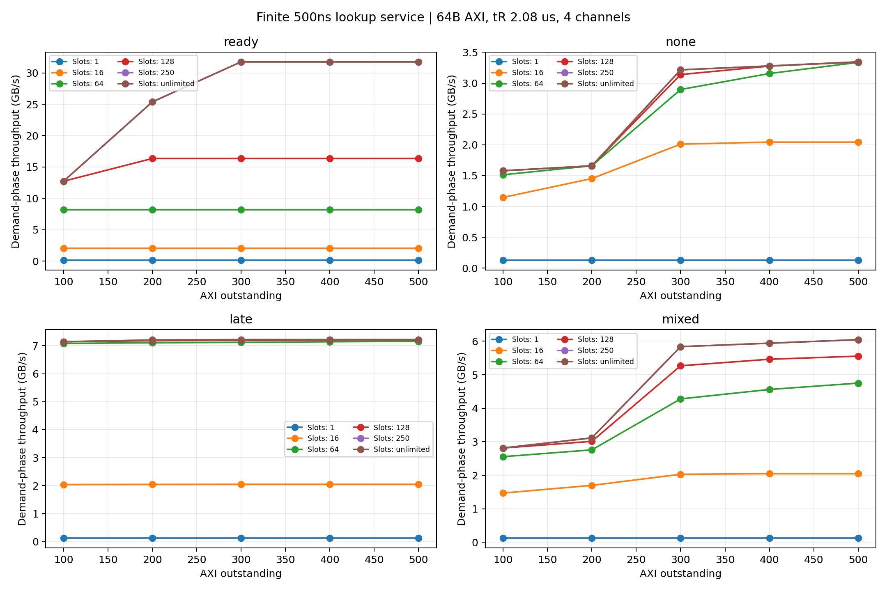
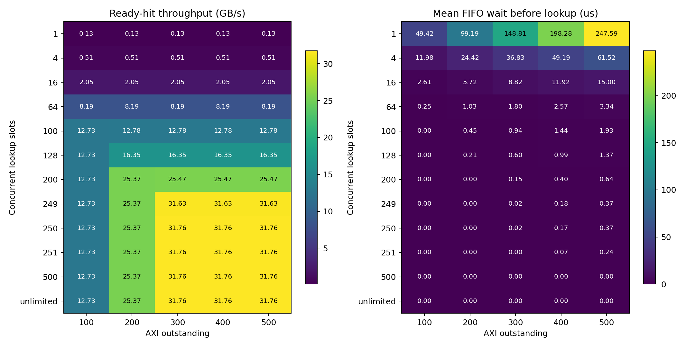

# 조회 병렬성을 제한했을 때의 64B 성능

기존 AXI/NAND 모델에 `lookup_slots`를 추가했다. 이전 무제한 모델은 `None`으로 그대로 재현할 수 있고, 양의 정수는 동시에 진행할 수 있는 hit/miss 조회 수다.

## 모델의 자원과 시간

- AR 수락 → FIFO 조회 대기 → 슬롯 확보 → 500ns 조회 → hit/miss 판정 → 데이터 준비·순서 대기 → AXI RLAST.
- 조회 슬롯은 조회 시작부터 완료까지 점유한다. 조회가 끝나면 슬롯을 반환하고 다음 대기 요청을 시작한다. NAND 읽기나 RLAST까지 슬롯을 잡고 있지 않는다.
- AXI outstanding은 AR부터 RLAST까지 유지한다. 조회 대기 중인 burst도 포함하므로 큐는 outstanding 수로 제한된다. AR 이전 대기는 별도다.
- FIFO 조회이고 lookup service latency는 고정이다. 한 slot은 최대 1/500ns = 2M lookup/s를 처리한다. 슬롯 수는 물리 SRAM port 수가 아니라 in-flight 조회 capacity다. 파이프라인의 initiation interval, lookup bank conflict, 별도 결과 큐 용량은 아직 모델링하지 않았다.
- 모든 burst는 각각 조회한다. NAND page read는 기존처럼 병합하지만 lookup 자체는 page 단위로 병합하지 않는다.

## 비교 조건

- 260개 조건, 조건당 32×64KiB 동시 요청; 요청당 64B AXI burst 1024개.
- tR 2.08µs, NAND page 16KiB, 4칩·독립 4채널, 채널당 2.4GB/s, 칩당 6 plane, buffer 8MiB. command 0.1µs, turnaround 0.05µs, ECC 0.2µs.
- AXI 256bit·1GHz, RREADY 항상 참, 전역 in-order. 64B 전송 T=2ns, 이론 상한 32GB/s.
- Outstanding 100/200/300/400/500. 조회 슬롯 1/4/16/64/100/128/200/249/250/251/500/무제한.
- ready/none/late/mixed 네 기존 시나리오. 조회 500ns를 비교하고, 무제한·조회 0ns 기준도 포함한다.
- ready는 사전 준비된 데이터의 상한 비교다. none은 프리페치 없음, late는 demand 1.5µs 전 발행, mixed는 절반의 logical request만 일찍 prefetch한다. 각 경우 실제 ready 비율은 CSV에 기록한다.
- 처리량 분모는 첫 AR부터 마지막 RLAST까지다. 사전 prefetch 시간은 제외되며 NAND의 지속 공급 성능을 의미하지 않는다. 64B 랜덤 주소 실험이 아니라 기존 64KiB 순차 요청을 64B로 분할한 실험이다.

## 핵심 경계

Ready-hit의 장기 처리량은 아래 세 상한의 최솟값을 넘을 수 없다. 유한 실행에는 초기 조회·종료 효과가 추가된다.

```text
B ≤ min(32, 0.128 × C, 64 × O / 502) GB/s
C = 동시 조회 슬롯, O = AXI outstanding
```

슬롯 64개이면 최대 8.192GB/s, 128개이면 16.384GB/s다. Outstanding만 500까지 늘려도 이 한계를 넘지 못한다. 32GB/s를 유지하려면 C≥250과 O≥251이 함께 필요하다. C=250은 조회 중인 요청 수, O=251은 그 밖의 반환 단계까지 포함한 수다.

## Ready hit의 전체 처리량

| 조회 슬롯 | O=100 | O=200 | O=300 | O=400 | O=500 |
|---:|---:|---:|---:|---:|---:|
| 1 | 0.128 | 0.128 | 0.128 | 0.128 | 0.128 |
| 4 | 0.512 | 0.512 | 0.512 | 0.512 | 0.512 |
| 16 | 2.048 | 2.048 | 2.048 | 2.048 | 2.048 |
| 64 | 8.188 | 8.188 | 8.188 | 8.188 | 8.188 |
| 100 | 12.726 | 12.777 | 12.777 | 12.777 | 12.777 |
| 128 | 12.726 | 16.351 | 16.351 | 16.351 | 16.351 |
| 200 | 12.726 | 25.370 | 25.471 | 25.471 | 25.471 |
| 249 | 12.726 | 25.370 | 31.632 | 31.632 | 31.632 |
| 250 | 12.726 | 25.370 | 31.758 | 31.758 | 31.758 |
| 251 | 12.726 | 25.370 | 31.758 | 31.758 | 31.758 |
| 500 | 12.726 | 25.370 | 31.758 | 31.758 | 31.758 |
| unlimited | 12.726 | 25.370 | 31.758 | 31.758 | 31.758 |

단위 GB/s. 무제한 행도 조회 서비스 시간은 500ns다. 조회 0ns·무제한 기준은 모든 O에서 32GB/s다.

## Outstanding 500에서 슬롯 제한 자체의 영향

| 슬롯 | 전체 GB/s | 무제한·500ns 대비 감소 | 평균 조회 대기 µs | 평균 AR→RLAST µs | p99 AR→RLAST µs |
|---:|---:|---:|---:|---:|---:|
| 1 | 0.128 | 99.60% | 247.591 | 248.093 | 250.000 |
| 4 | 0.512 | 98.39% | 61.520 | 62.023 | 62.500 |
| 16 | 2.048 | 93.55% | 14.997 | 15.506 | 15.976 |
| 64 | 8.188 | 74.22% | 3.344 | 3.877 | 3.976 |
| 128 | 16.351 | 48.51% | 1.375 | 1.940 | 1.976 |
| 200 | 25.471 | 19.80% | 0.642 | 1.244 | 1.300 |
| 250 | 31.758 | 0.00% | 0.370 | 0.996 | 1.000 |
| 500 | 31.758 | 0.00% | 0.000 | 0.996 | 1.000 |
| unlimited | 31.758 | 0.00% | 0.000 | 0.996 | 1.000 |

슬롯이 병목이면 outstanding 증가는 처리량 개선 대신 조회 큐와 응답 지연을 늘릴 수 있다. 조회 서비스 500ns와 AR→조회 완료 시간을 구분해야 한다. 후자는 FIFO 대기까지 포함한다.





## NAND 경로: O=500

| 조건 | 슬롯 4 GB/s | 슬롯 64 GB/s | 슬롯 128 GB/s | 슬롯 250 GB/s | 무제한 GB/s |
|---|---:|---:|---:|---:|---:|
| none | 0.512 | 3.336 | 3.342 | 3.344 | 3.344 |
| late | 0.512 | 7.157 | 7.206 | 7.218 | 7.218 |
| mixed | 0.512 | 4.750 | 5.555 | 6.047 | 6.047 |

NAND가 필요한 경로에서는 조회 처리량뿐 아니라 page 병합, NAND 준비 시간, in-order head-of-line 대기가 함께 작용한다. Ready-hit 상한식만으로 이 경로의 성능을 결정할 수 없다.

## 검증·재현

- 26개 테스트 통과: 기존 20개 + 유한 슬롯 6개. 독립적인 FIFO/AR/R 재귀식과 16개 슬롯·outstanding 조합을 대조했다.
- 유한 슬롯≥outstanding은 무제한 결과와 일치한다. 조회 0ns·슬롯 1개도 무제한과 일치한다. 작은 버퍼에서 순서 보장·진행, miss의 조회 이후 발행, 슬롯/큐 한도를 검증했다.
- 원본 commit의 기존 32개 조건에서 모든 기존 지표, 요청 기록 및 기존 이벤트가 정확히 일치한다. 새 lookup_start/lookup_done trace와 lookup 대기 지표만 추가된다.
- HOL idle 계측은 준비된 active burst 집합으로 계산한다. 완료된 burst 전체를 반복 검색하지 않아 작은 슬롯·많은 64B burst의 실행 비용을 줄인다.

```sh
python3 -m unittest -q
python3 experiments/run_lookup_slots.py
python3 experiments/summarize_lookup_slots.py
```

직접 설정 예:

```python
from axi_burst_sim import Config, Simulator
cfg = Config(requests=32, burst_bytes=64, tr_us=2.08, axi_clock_mhz=1000,
             lookup_us=0.5, lookup_slots=64, outstanding=500, scenario="ready")
metrics, requests = Simulator(cfg).run()
```

`sweep.csv`: 전체·후반 처리량, 평균·p99 burst 지연, 평균·최대 조회 대기, peak 조회 동시성·큐 길이와 기존 NAND 지표. `example_timeline.csv`: C=4/O=500의 첫 16 burst 시간(us, 첫 demand 기준). `manifest.json`: 기준 설정·원본 commit·소스 SHA256.

기존 GUI는 이전 결과를 표시한다. 이번 확장은 Python 설정·CSV·그래프에 반영했으며 제품 실측이나 신호 수준 RTL 검증은 아니다.
