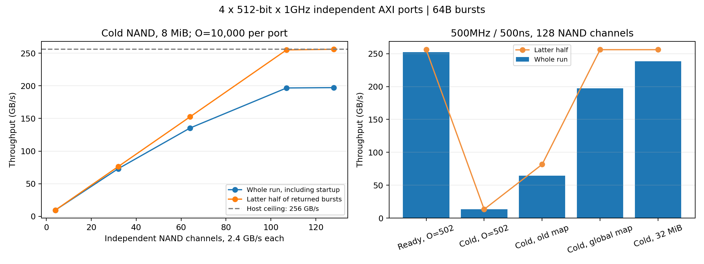

# 4포트·512bit Host와 NAND 확장 모델

단일 포트 모델을 보존하고 `MultiportSimulator`를 추가했다. 512bit·1GHz 독립 포트 4개는 포트당 64GB/s, 합계 256GB/s다. 기존 64B burst를 유지한다.

## 반영 사항

- 포트별 AR admission, outstanding, FIFO 조회 큐, 조회 슬롯·파이프라인, R 반환 상태를 분리했다. 포트는 동시에 반환할 수 있다.
- Burst ID를 round-robin으로 포트에 배정한다. 각 포트는 수락 순서대로 반환하며 포트 간 전역 반환 순서는 강제하지 않는다. Logical request는 해당 요청의 모든 burst가 끝난 시점에 완료한다.
- NAND page read와 controller buffer는 공유한다. 여러 포트가 같은 page를 조회해도 NAND 읽기는 한 번만 실행한다.
- `global_striped`는 전체 page ID로 chip을 분배한다. `chip=page_id % chips`, `plane=(page_id // chips) % planes`, `channel=chip % channels`다. 기존 striped/single 배치는 보존한다.
- 공유 버퍼가 작은 경우 가장 오래된 미반환 page의 공간을 보호해 진행을 보장한다. 포트별 HOL idle도 별도로 계측한다.
- 파워는 포트별 lookup clock gating과 슬롯·파이프라인 비용을 합산한다. 공유 NAND 전송 에너지는 한 번만 부과한다. 기존 단일 포트의 에너지 결과는 유지한다.

## 조회·요청창의 권장 구성

| 항목 | 포트당 | 4포트 합계 |
|---|---:|---:|
| 500MHz 조회 슬롯, 지연 500ns | 500 | 2,000 |
| 조회 파이프라인, 매 클럭 새 조회 수락 | 2 | 8 |
| Ready-hit outstanding 권장 | 502 | 2,008 |
| NAND 공급 실험 outstanding | 10,000 | 40,000 |
| 1GHz·0ns 비교 설계의 슬롯 | 2,000 | 8,000 |

앞서 계산한 ready-hit outstanding 501은 클럭 정렬 대기를 생략한 경계다. 500MHz lookup은 2ns edge에서 시작하고 AR은 1ns마다 도착한다. 정렬 대기 최대 1ns, 조회 500ns, 반환 1ns를 포함해 포트당 502개가 있어야 끊김 없이 반환한다. C=500은 충분하다. O=501에서는 주기적인 1ns 반환 공백이 생긴다.

## 실제 실행 결과

| 조건, 500MHz·500ns | 작업량 MiB | 전체 GB/s | 후반부 GB/s |
|---|---:|---:|---:|
| Ready, O=501 | 8 | 251.65 | 255.49 |
| Ready, O=502 | 8 | 252.14 | 256.00 |
| NAND 4채널, O=10,000 | 8 | 9.50 | 9.53 |
| NAND 32채널, O=10,000 | 8 | 72.97 | 76.24 |
| NAND 64채널, O=10,000 | 8 | 135.32 | 152.48 |
| NAND 107채널, O=10,000 | 8 | 196.73 | 255.11 |
| NAND 128채널, O=10,000 | 8 | 197.26 | 256.00 |
| NAND 128채널, O=502 | 8 | 13.41 | 13.42 |
| NAND 128채널, 기존 배치 | 8 | 64.31 | 81.66 |
| NAND 128채널, 긴 실행 | 32 | 238.26 | 256.00 |

전체 처리량은 첫 AR부터 최종 RLAST까지의 반환 바이트/시간이다. 후반부는 전체 burst 절반이 반환된 시점부터 마지막 반환까지 공통 시간창에서 계산한다. 독립 포트별 처리량을 서로 다른 시간창으로 더한 값은 별도 `sum_port_tail_throughput_gbps`로 기록하며 대표 후반부 지표로 사용하지 않는다.

1GHz·0ns ready 기준은 전체·후반부 모두 256GB/s다. 500MHz ready도 후반부 256GB/s지만 초기 500ns 조회 때문에 8MiB 작업의 전체 평균은 252.14GB/s다. NAND 128채널에서는 초기 page 준비를 포함해 8MiB 평균 197.26GB/s, 32MiB 평균 238.26GB/s이며 후반부는 두 경우 모두 256GB/s다.

107채널은 256/2.4를 올림한 원시 대역폭 경계다. page당 turnaround 0.05µs를 포함한 채널 공급 상한은 `16,384B / (16,384B / 2.4GB/s + 0.05µs)`이며, 107개 합계는 256GB/s에 못 미친다. 유한 실행의 후반부 값에는 이미 준비된 page와 종료 효과가 포함된다. 128채널은 원시 307.2GB/s로 여유를 둔 구성이다.

## 파워 결과의 해석

아래는 clock gating 적용, fast 슬롯 4배·동일 파이프라인 수 조건의 slow/fast 에너지비다. 예시 EU 계수이며 실제 W·J가 아니다. 낮은 전압에서도 500MHz를 유지할 수 있다고 가정한다.

| 조건 | 동일 전압 에너지비 | Slow 0.8V 에너지비 |
|---|---:|---:|
| Ready, 8MiB | 76.3% | 55.8% |
| NAND 128채널, 32MiB | 91.5% | 84.2% |

NAND/PHY/포트 인터커넥트의 실제 전력과 채널 수에 따른 누설 증가를 산정한 결과가 아니다. 공유 background 계수는 고정이며 lookup clock·슬롯·파이프라인·조회 연산·FIFO·시간 기반 누설·AXI bytes·NAND bytes만 명시적으로 계산한다.



## 경계와 검증

- 내부 fabric과 공유 SRAM이 합계 256GB/s의 동시 읽기를 처리할 수 있다고 가정한다. 별도 fabric arbitration, SRAM bank conflict, PHY/protocol overhead, AXI ID·신호 수준 동작은 아직 모델링하지 않는다.
- NAND chip은 추상적인 독립 자원이다. 기본 128chip·128channel·chip당 6plane, page 16KiB, tR 2.08µs, 채널당 2.4GB/s다. 실제 패키지·die/LUN 구성은 따로 대응시켜야 한다.
- Ready의 사전 prefetch 시간·에너지는 측정에서 제외한다. Cold NAND는 프리페치 없이 첫 조회 이후 읽는다. 버퍼 기본 8MiB는 전체 NAND 저장 용량이 아닌 controller credit 용량이다.
- 43개 테스트 통과. 독립 포트별 AR/slot/pipeline/clock/R 재귀식, 256GB/s 상한, O=501/502 경계, 128채널 분산, 공유 page 병합, 작은 버퍼 진행, 포트 간 독립 반환, 에너지 합산을 검증했다.
- 직전 단일 포트 모델의 32개 조건에서 지표·요청 기록·이벤트 trace·에너지가 정확히 일치한다.
- 24개 성능 실행, 60개 에너지 계산. manifest에는 구성·EU 계수·소스 SHA256을 기록했다.

## 실행

```sh
python3 -m unittest -q
python3 experiments/run_multiport_256.py
python3 experiments/summarize_multiport_256.py
python3 multiport_sim.py --config results/multiport_256/config_slow_ready.json --out scratch/multiport_ready
```

`--trace`를 추가하면 전체 이벤트 CSV를 기록한다. `outstanding`, `lookup_slots`, `lookup_pipelines`는 모두 **포트당** 설정이다.

```python
from multiport_sim import MultiportConfig, MultiportSimulator
cfg = MultiportConfig(requests=512, scenario="none", outstanding=10000, record_trace=False)
metrics, requests = MultiportSimulator(cfg).run()
```

기존 GUI의 내장 결과는 이전 단일 포트 실험이며 이번 확장을 표시하지 않는다.
